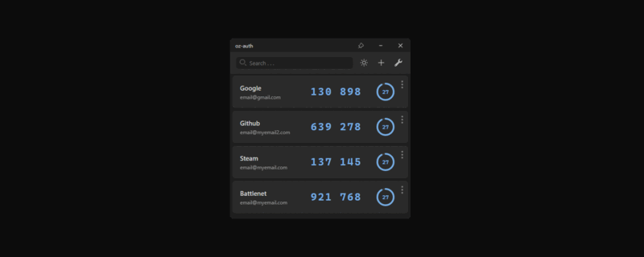

<h1 align="center">oz-auth</h1>

<p align="center">
  <strong>Portable Desktop TOTP Authenticator</strong><br>
  Secure, offline two-factor authentication for Windows. No installer. No cloud. No compromise.
</p>

<p align="center">
  <a href="https://github.com/kardelitaitu/oz-auth/blob/main/LICENSE"></a>
  
  
  
  
  
</p>

<p align="center">
  
</p>


## Why oz-auth?

Most authenticator apps are mobile-only, closed-source, or require cloud sync. oz-auth is:

- **Desktop-native** — lives on your taskbar, not your phone
- **Fully offline** — zero network permissions, zero telemetry
- **Portable** — single `.exe` + `.auth` file. Run from a USB stick.
- **Open source** — inspect every line of code that touches your secrets

---

## Features

| | Feature | Details |
|---|---------|---------|
| 💾 | **Portable** | Single ~10 MB executable. No installer, no dependencies. Run from USB. |
| 🔑 | **TOTP Codes** | RFC 6238 compliant. SHA-1/256/512, 6 & 8 digit codes. |
| 🔒 | **Encrypted Storage** | AES-256-GCM + Argon2id key derivation. Portable `.auth` file. |
| 🔐 | **PIN Protection** | Lock/unlock with PIN. Auto-lock after configurable inactivity. |
| 🖥️ | **System Tray** | Real-time countdown pie icon. Left-click toggles window. |
| ↕️ | **Drag & Drop** | Reorder accounts by dragging any card. |
| 🎨 | **Themes** | Dark/light mode. Follows system preference. |
| 📋 | **Auto-Clear Clipboard** | Copied codes cleared after 30 seconds. |
| ⌨️ | **Keyboard Shortcuts** | `Ctrl+N` add, `Ctrl+F` search, `Ctrl+L` lock, `Esc` dismiss |
| 🔍 | **Instant Search** | Filter accounts as you type. |
| 📐 | **Window Memory** | Remembers size, position, and always-on-top state. |
| 🛡️ | **Memory Hardened** | Secrets zeroized after use. Key `VirtualLock`-ed on Windows. |

---

## Quick Start


Download `oz-auth.exe` from [Releases](https://github.com/kardelitaitu/oz-auth/releases). Place them in the same folder (eg: 'My Documents'). Run. That's it. (it will generate the .auth file after do any changes)  
For multiple notes. You can copy the .exe and rename it.  
Then you can put the shortcut on 'C:\Users\YOUR_USERNAME\AppData\Roaming\Microsoft\Windows\Start Menu' if needed, so you can call it from start menu search.


<details>
<summary><strong>Click to expand</strong></summary>

**Prerequisites:** [Rust](https://rustup.rs/) 1.80+, [Node.js](https://nodejs.org/) 18+, Windows 10+

```bash
git clone https://github.com/kardelitaitu/oz-auth.git
cd oz-auth
npm install
```

**Development (hot-reload):**

```bash
cargo tauri dev
```

**Production build:**

```bash
npm run tauri        # Builds frontend + packages .exe (~6 min on 32-core)
```

The output is at `src-tauri/target/release/oz-auth.exe`.

> **Note:** `beforeBuildCommand` is omitted from `tauri.conf.json` intentionally to avoid a Vite v6 subprocess exit-code issue on Windows.

### All Commands

| Command | Description |
|---------|-------------|
| `cargo tauri dev` | Dev mode with hot-reload |
| `npm run tauri` | Full production build |
| `cargo test` | Run 476 Rust tests |
| `npx vitest run` | Run 104 frontend tests |
| `cargo clippy -- -D warnings` | Lint (strict) |
| `cargo fmt --check` | Check formatting |
| `cargo check` | Type-check only |

---

## Usage

### Adding an Account

Click **+** (or `Ctrl+N`) → enter **Issuer** (e.g. "Google"), **Label** (e.g. "user@gmail.com"), and **Secret Key**.

### Managing Accounts

| Action | How |
|--------|-----|
| **Copy code** | Click the code on any card |
| **Edit** | Click pencil icon or right-click → Edit |
| **Delete** | Click × or right-click → Delete |
| **Reorder** | Drag any card to a new position |
| **Search** | Type in the search bar (`Ctrl+F`) |

### Backup & Restore

The `.auth` file lives next to `oz-auth.exe` (same folder, same base name).

- **Backup:** Copy the `.auth` file to a safe location.
- **Restore:** Replace the `.auth` file next to the `.exe` and restart.

---

## Security Design

oz-auth assumes your desktop could be compromised. Every layer minimizes the window where secrets exist in plaintext.

### At Rest

- Accounts stored in a portable `.auth` JSON file
- Secrets encrypted with **AES-256-GCM** (unique nonce per write)
- Key derived from PIN via **Argon2id** (memory-hard, GPU-resistant)
- No PIN = plaintext storage (prompted to set PIN on first launch)

### In Memory

- Encryption key wrapped in `Zeroizing<[u8; 32]>` — overwritten on `lock()`
- `VirtualLock` prevents key from being paged to swap (Windows)
- All decrypted secrets zeroized after every TOTP generation
- All intermediate buffers zeroized after encrypt/decrypt
- Frontend never sees raw secrets — only `AccountSummary` (no `secret` field) via IPC
- `SetProcessMitigationPolicy` blocks dynamic code execution and remote image loads
- In-memory cache with mtime staleness detection — avoids repeated disk reads

### In Transit (IPC)

- All WebView ↔ Rust communication uses Tauri's IPC
- Secrets never leave Rust — codes generated entirely in backend
- Clipboard auto-clears after 30 seconds

---

## Architecture

```
┌─────────────────────────────────────┐
│       FRONTEND (WebView)            │
│  Vanilla JS + Vite + @tauri-apps    │
│  Cards · Countdown · Drag & Drop    │
│  Lock screen · Settings · Themes    │
└──────────────────┬──────────────────┘
                   │  invoke() — Tauri IPC
┌──────────────────┴──────────────────┐
│       BACKEND (Rust)                │
│  totp-rs · AES-256-GCM · Argon2id   │
│  .auth file · System tray           │
│  Process mitigation · Diagnostics   │
└─────────────────────────────────────┘
```

### Tech Stack

| Layer | Technology |
|-------|-----------|
| Framework | Tauri v2 |
| Backend | Rust (edition 2021) |
| Frontend | Vanilla HTML/CSS/JS + Vite |
| TOTP Engine | `totp-rs` v5 (RFC 6238) |
| Encryption | `aes-gcm` v0.10 + `argon2` v0.5 |
| Memory Security | `zeroize` v1.9 |

<details>
<summary><strong>Project Structure</strong></summary>

```
tauri-authenticator/
├── src/                        # Frontend (WebView)
│   ├── main.js                 # Orchestrator
│   ├── js/                     # TOTP, accounts, clipboard, lock, settings, drag & drop
│   │   └── __tests__/          # Vitest frontend tests (104 tests)
│   └── styles/                 # Global styles, theme variables
├── src-tauri/                  # Backend (Rust)
│   └── src/
│       ├── commands/            # totp, accounts, auth (with sub-modules: crud, qr)
│       ├── storage/auth_file.rs # .auth file I/O + encrypt/decrypt
│       ├── crypto.rs            # Argon2id + AES-256-GCM
│       ├── tray.rs              # System tray (pie icon, menu)
│       ├── audit.rs             # Signed audit trail with hash chain
│       ├── test_utils.rs        # Shared test helpers
│       └── diagnostics.rs       # Crash logging, event log
├── index.html                  # Vite entry point
├── package.json                # Frontend dependencies
├── AGENTS.md                   # AI assistant instructions
├── PLAN.md                     # Architecture & planning
└── CHANGELOG.md                # Release history
```

</details>


---


### Contributing 

Contributions are welcome. To get started:

1. Fork the repository
2. Create a feature branch (`git checkout -b feature/my-feature`)
3. Make your changes and run `cargo test && cargo clippy -- -D warnings`
4. Commit with a clear message
5. Open a pull request

For architectural decisions, see [PLAN.md](PLAN.md).

</details>

---


See [CHANGELOG.md](CHANGELOG.md) for release history.

---


[MIT](LICENSE) © kardelitaitu
